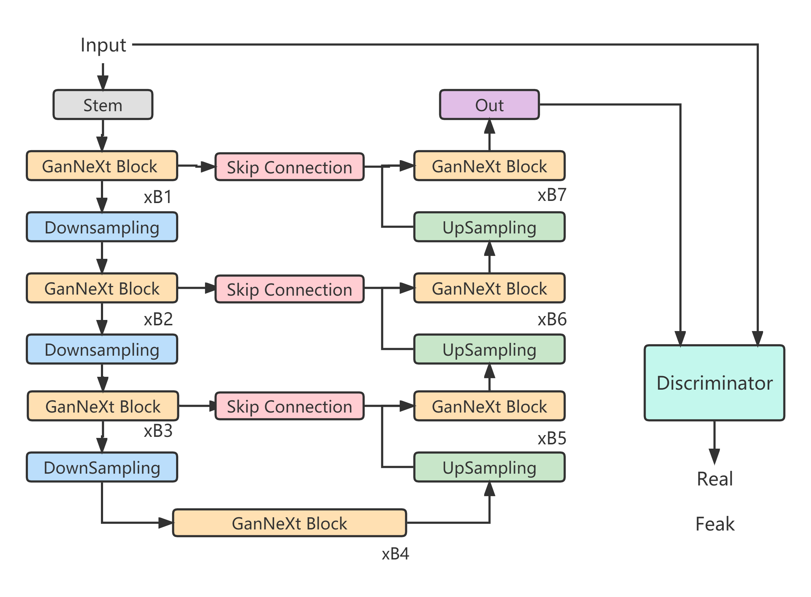
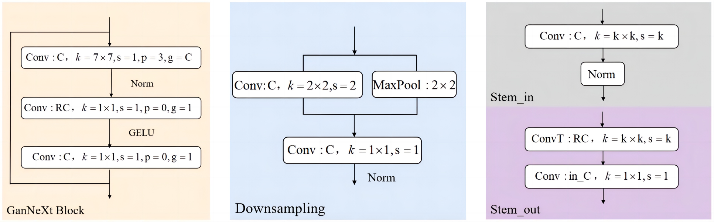

# GanNeXt


## Paper Introduction
Anomaly detection refers to the process of detecting anomalous values in datasets that do not follow a normal distribution. In recent years, Transformer-based methods utilizing generative adversarial networks (GANs) have shown remarkable performance in this field. Unlike traditional convolutional architectures, Transformer structures are adept at capturing long-range dependencies, leading to a substantial improvement in the ability to detect anomalies. However,transformer-based vision models exhibit lower capability in capturing fine-grained details and lower inference speed. In this paper, we propose a scalable convolutional Generative Adversarial Network (GAN) called GanNeXt. Our design incorporates a modern convolutional architecture that utilizes depthwise convolutional layers and pointwise convolutional layers as extension layers. Additionally, we introduce skip connections to capture multi-scale local details. Experiments demonstrate that our proposed method achieves a 58\% reduction in floating-point operations per second(FLOPs), while performing comparably to state-of-the-art Transformer-based GAN baselines.

<div align="center">
    
</div>
## 2. Installation

1. First clone the repository
   ```
   git clone https://github.com/2020141461053/GanNeXt.git
   ```
2. Create the virtual environment via conda
    ```
    conda create -n skipganomaly python=3.7
    ```
3. Activate the virtual environment.
    ```
    conda activate skipganomaly
    ```
4. Install the dependencies.
   ```
   pip install --user --requirement requirements.txt
   ```

## 3. Experiment
To replicate the results in the paper for CIFAR10  dataset, run the following commands:

``` shell
# CIFAR
sh experiments/run_cifar.sh
```

## 4. Training
To list the arguments, run the following command:
```
python train.py -h
```

### 4.1. Training on CIFAR10
To train the model on CIFAR10 dataset for a given anomaly class, run the following:

``` 
python train.py \
    --dataset cifar10                                                             \
    --niter <number-of-epochs>                                                    \
    --abnormal_class                                                              \
        <airplane, automobile, bird, cat, deer, dog, frog, horse, ship, truck>    \
    --display                                   # optional if you want to visualize        
```

### 4.2. Train on Custom Dataset
To train the model on a custom dataset, the dataset should be copied into `./data` directory, and should have the following directory & file structure:

```
Custom Dataset
├── test
│   ├── 0.normal
│   │   └── normal_tst_img_0.png
│   │   └── normal_tst_img_1.png
│   │   ...
│   │   └── normal_tst_img_n.png
│   ├── 1.abnormal
│   │   └── abnormal_tst_img_0.png
│   │   └── abnormal_tst_img_1.png
│   │   ...
│   │   └── abnormal_tst_img_m.png
├── train
│   ├── 0.normal
│   │   └── normal_tst_img_0.png
│   │   └── normal_tst_img_1.png
│   │   ...
│   │   └── normal_tst_img_t.png

```

Then model training is the same as the training explained above.

```
python train.py                     \
    --dataset <name-of-the-data>    \
    --isize <image-size>            \
    --niter <number-of-epochs>      \
    --display                       # optional if you want to visualize
```

For more training options, run `python train.py -h`.

## 5. Citing GanNeXt
If you use this repository or would like to refer the paper, please use the following BibTeX entry
```

```

## 6. Reference

